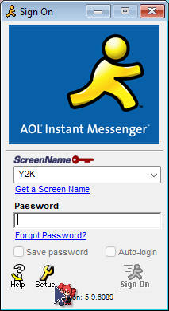

# Connection details

> **Internet:** `aim.millennia.chat` — **Port:** `5190`
>
> **VCFMW Show DSL:** `TBD` — **Port:** `5191`

**Protocol:** AIM (OSCAR) — **Default port: `5190`**

---

## Step‑by‑step: Connecting with a Windows AIM client

1. **Install AIM** (versions **2.x–5.x** are supported with Millennia Chat).
2. **Open AIM** but do not sign on yet.
3. Click the **Setup** (yellow wrench) button, then **Connection**.
   
   

4. Replace the **Host** with `aim.millennia.chat` and make sure **Port** is set to `5190`.
	- If you're on the show's DSL network, you should instead use the **VCFMW Show DSL** IP and port listed above.
   
   

5. Make sure **Connect using proxy** is **unchecked**.
6. Click **OK** → **OK**.
7. Enter your desired screen name and any password, then click **Sign On**. <u>No sign-up required!</u>

---

## Step‑by‑step: Connecting with a classic Macintosh AIM client (Mac OS 7, 8, 9)

Classic AIM clients for Mac OS 7/8/9 do not provide an interface to change the server host. You must use **ResEdit** to modify the application resources:

1. **Download and install ResEdit or Super ResEdit** if you don't already have it. 
	- These applications can be found on **Macintosh Garden**.
2. Make a **backup copy** of your AIM application.
3. Open the AIM application with ResEdit.
   
   

4. Locate the **STR# resource** and double-click on it to open it.
   
   

5. Locate the **"AIM Server"** entry and double-click on it.
6. Find the default server entry (`login.oscar.aol.com`).
7. **Replace the server string** with `aim.millennia.chat`, and replace the port string with `5190`.
	- If you're on the show's DSL network, you should instead use the "VCFMW Show DSL" IP and port listed above.
   
   

8. **Save the changes** and close ResEdit.
9. Launch AIM and sign on with your desired screen name, and use any password. <u>No sign-up required!</u>

**Note:** Do not change any other strings or resources to avoid corrupting the application.